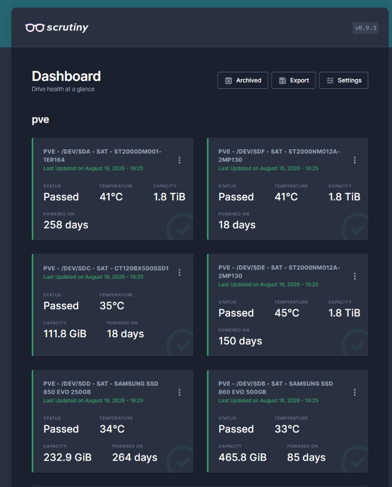

# Scrutiny (drive SMART / temperature)

**Status:** Live (LAN only)  
**Last verified:** 2026-08-22 — hub + **systemd timer enabled**; dashboard current for all 6 disks  
**UI:** http://192.168.1.20:8080  

Screenshot (under load, timer live): [`dashboard-2026-08-16.png`](dashboard-2026-08-16.png)



---

## 1. Role

Hard-drive health **dashboard**: SMART status and temperature history. Does **not** replace Proxmox
ZFS pool notifications (`zoho-smtp`); it complements them with per-disk trends.

**Scrutiny does no alerting here, by decision (2026-08-22).** Its shoutrrr notifications were
never enabled, and temperature alerting is instead done on the host by
[`../proxmox-host/configs/drive-temp-alert.sh`](../proxmox-host/configs/drive-temp-alert.sh)
— reading SMART directly with `smartctl` and mailing via `curl`. Rationale: an alert about a
dying disk must not depend on this container being up, and it keeps one notification transport
rather than two.

So treat this UI as **trend inspection, not monitoring**. Nothing here will page you.

**Open gap:** no alerting exists on reallocated / pending sector growth or failed self-tests —
the strongest pre-failure signals, and ones ZFS reports nothing about (`zpool status` stays
`ONLINE` until an unrecoverable read). Fix by extending `drive-temp-alert.sh` to alert on
*increase from a stored baseline* for attributes 5, 197 and 198, or by enabling shoutrrr here.

---

## 2. Where it runs (Hub–Spoke)

| Piece | Where | Notes |
|-------|--------|--------|
| **Hub** (Web UI + InfluxDB) | LXC **102** `scrutiny` on LAN `vmbr0` | Unprivileged + **nesting**; Docker Compose |
| **Spoke** (collector) | Proxmox host `pve` | Binary + systemd timer; only place with real SMART access |
| Public / DMZ / Dockploy | **No** | Internal ops only |

### LXC 102

| Item | Value |
|------|--------|
| Hostname | `scrutiny` |
| Template | Debian 13 `amd64` (`debian-13-standard_13.6-1_amd64.tar.zst`) |
| IP | `192.168.1.20/24`, gw/DNS `192.168.1.1` |
| Resources | 2 vCPU, 2048 MB RAM, 512 MB swap, 10 GB root on `local-zfs` |
| Features | unprivileged, nesting |
| Compose dir | `/opt/scrutiny` |

### Host collector

| Item | Value |
|------|--------|
| Binary | `/opt/scrutiny/bin/scrutiny-collector-metrics` (v0.9.3 linux-amd64) |
| API | `http://192.168.1.20:8080` |
| Host ID | `pve` |
| Unit files | `/etc/systemd/system/scrutiny-collector.service` + `.timer` (copies in this folder) |
| Timer | **enabled** — every **15 minutes** (`OnUnitActiveSec=15min`); verified 2026-08-16 |

Without the timer, the UI stays frozen at the last manual collect. Install from this folder’s unit files, then:

```bash
systemctl daemon-reload
systemctl enable --now scrutiny-collector.timer
systemctl start scrutiny-collector.service   # immediate refresh
```

---

## 3. Locked software versions

| Component | Version / image |
|-----------|-----------------|
| Scrutiny web | `ghcr.io/analogj/scrutiny:v0.9.3-web` |
| Collector binary | release **v0.9.3** (must match web) |
| InfluxDB | `influxdb:2.8` |
| Docker (in CT) | Engine 29.x + Compose plugin |

Configs in this folder:

| File | Role |
|------|------|
| [`docker-compose.yml`](docker-compose.yml) | Hub stack (web + InfluxDB; Influx **not** published to LAN) |
| [`scrutiny.yaml`](scrutiny.yaml) | Web config (`/opt/scrutiny/config/scrutiny.yaml` in CT) |
| [`scrutiny-collector.service`](scrutiny-collector.service) | Host oneshot collector |
| [`scrutiny-collector.timer`](scrutiny-collector.timer) | Host schedule |

---

## 4. Disks on `pve`

| Device | Model | Role (approx.) |
|--------|--------|----------------|
| `/dev/sda` | ST2000DM001-1ER164 | `tank` HDD |
| `/dev/sde` | ST2000NM012A-2MP130 | `tank` HDD |
| `/dev/sdf` | ST2000NM012A-2MP130 | `tank` HDD |
| `/dev/sdb` | Samsung 860 EVO 500GB | `rpool` |
| `/dev/sdd` | Samsung 850 EVO 250GB | `rpool` |
| `/dev/sdc` | Crucial BX500 120GB | planned local backup |

ZFS zvol devices (`zd*`) are not SMART targets — correctly ignored.

Watch **`WS109WW8`** first under heavy `tank` writes (hottest of the three HDDs). Treat sustained **≥50 °C** as “improve airflow”; **≥55 °C** as urgent.

---

## 5. Day-2 ops

### Hub (inside CT 102)

```bash
pct enter 102   # or Console on CT 102
cd /opt/scrutiny
docker compose ps
docker compose logs -f scrutiny-web
docker compose pull && docker compose up -d   # only when intentionally upgrading pins
```

### Collector (on host)

Unit: `scrutiny-collector.timer`. Manual refresh: `systemctl start scrutiny-collector.service`.

### Upgrade rule

Bump **web image tag** and **collector binary** to the **same** Scrutiny version together. Mismatched versions can leave an empty dashboard.

---

## 6. Open to-do

- [ ] Email / notify URLs in Scrutiny (Zoho SMTP via shoutrrr) for fail / high temp
- [ ] Optional: document notify thresholds after first heavy `tank` write soak finishes

---

## 7. Related

- [`../proxmox-host/`](../proxmox-host/) — disks / pools  
- Proxmox Datacenter notifications (`zoho-smtp`) — ZFS pool events (separate from Scrutiny)  
